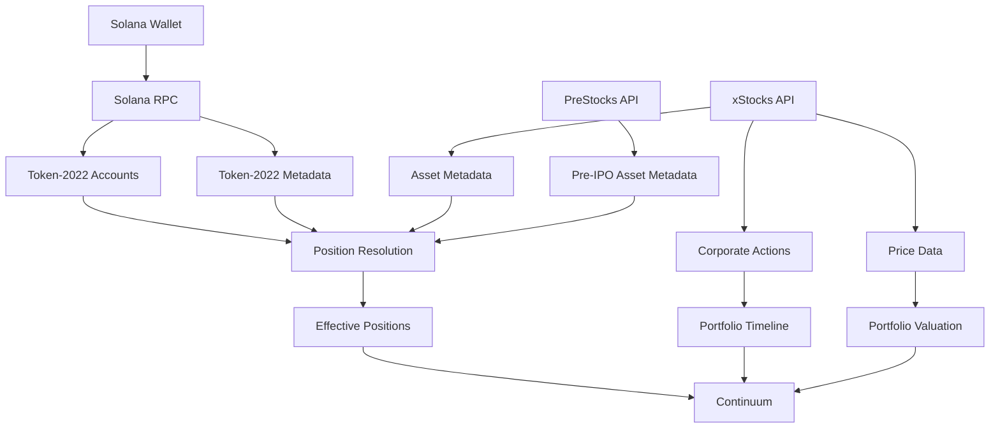

# Continuum

### Your portfolio, understood over time.

Continuum is a portfolio intelligence layer for tokenized stocks on Solana.

It answers a simple question:

> **What do I actually own — and why is my position what it is today?**

Traditional portfolio applications show the current number. Continuum reconstructs the meaning behind that number by combining on-chain Token-2022 state, asset metadata, corporate actions, and effective-position calculations.

**See what you own. Understand what changed. Know why.**

---

## The core idea

A raw token balance is not always the most useful representation of an economic position.

Continuum separates:

```text
Raw on-chain position
        ↓
Token-2022 multiplier
        ↓
Effective position
        ↓
Corporate-action history
        ↓
Portfolio intelligence
```

For example:

```text
8.000000 raw units
× 1.486135 Token-2022 multiplier
= 11.889078 effective units
```

The raw balance comes from Solana.

The multiplier comes from Token-2022 metadata.

The effective position is calculated from those verified inputs.

Continuum makes that relationship visible instead of hiding it behind a portfolio number.

---

## Why Solana?

Solana is part of the accounting model, not simply the wallet connection.

Continuum uses Solana to:

- discover Token-2022 accounts owned by a wallet
- identify supported tokenized-stock mints
- read raw token balances
- inspect Token-2022 scaling metadata
- resolve the active multiplier
- derive effective economic positions
- link positions back to their underlying mint

The relevant Token-2022 program is:

```text
TokenzQdBNbLqP5VEhdkAS6EPFLC1PHnBqCXEpPxuEb
```

This gives Continuum a verifiable starting point:

> **The portfolio begins with on-chain state.**

---

## Architecture



### Position pipeline

```text
Wallet
  ↓
Token-2022 accounts
  ↓
Known tokenized assets
  ↓
Raw balance + multiplier
  ↓
Effective position
  ↓
Corporate-action history
  ↓
Portfolio timeline
```

---

## Product

Continuum has one product spine.

### Portfolio

Shows what the wallet currently holds:

- total portfolio value
- detected holdings
- effective position
- raw on-chain balance
- Token-2022 multiplier
- allocation
- indicative/token price
- asset type

### Timeline

Shows what happened over time:

- stock splits
- dividends
- Token-2022 scaling
- other recorded lifecycle events

### Corporate Actions

Shows the underlying lifecycle events and identifies positions for which no historical event is currently available.

### Position Trace

Selecting an asset exposes the calculation behind the position:

```text
Raw on-chain
     ×
Multiplier
     =
Effective position
```

The interface also links directly to the underlying Solana mint.

---

## PreStocks integration

Continuum integrates **PreStocks** as its Stocklana sponsor-bounty integration.

PreStocks provides tokenized pre-IPO exposure. Continuum resolves those assets using their contract addresses and incorporates them into the same position model.

```text
PreStocks raw units
        ×
Token-2022 multiplier
        =
Effective exposure
```

This allows public tokenized equities and pre-IPO exposure to live inside one portfolio intelligence layer while remaining clearly identified as different asset types.

PreStocks metadata is used for:

- asset identity
- contract address
- token price
- mark price
- valuation
- product links

---

## Trust model

Continuum distinguishes between three kinds of information.

### Verified

Directly sourced from Solana, xStocks, or PreStocks.

### Derived

Calculated from verified inputs.

For example:

```text
effective position = raw units × multiplier
```

### Illustrative

Controlled demo data used to demonstrate the product experience.

Demo data is never presented as the connected wallet's real holdings.

In Live mode, if the connected wallet has no supported positions, Continuum shows an empty verified portfolio rather than fabricating one.

> **The interface should never be more certain than its underlying data.**

---

## Demo mode vs Live mode

### Demo

The demo provides a controlled scenario showing:

- split-adjusted positions
- dividends
- Token-2022 scaling
- PreStocks exposure
- portfolio history
- position-level tracing

This makes the core product idea immediately understandable.

### Live

Live mode derives positions from the connected Solana wallet:

```text
Wallet
→ Token-2022 balances
→ Supported assets
→ Multipliers
→ Effective positions
→ Portfolio
```

Live data is never replaced with synthetic holdings.

---

## Technology

| Layer | Technology |
|---|---|
| UI | React + TypeScript |
| Build | Vite |
| Blockchain | Solana |
| Token standard | SPL Token-2022 |
| Wallets | Phantom / Solflare / injected Solana providers |
| Tokenized stocks | xStocks API |
| Pre-IPO assets | PreStocks API |
| RPC | Solana JSON-RPC / Helius |
| Styling | Custom CSS |

The application intentionally keeps the core architecture small: the browser coordinates the portfolio data sources while development-time Vite proxies handle RPC and API requests.

---

## Project structure

```text
continuum/
├── src/
│   ├── App.tsx          # Product UI and portfolio state
│   ├── api.ts           # Solana + xStocks data access
│   ├── prestocks.ts     # PreStocks integration
│   ├── styles.css       # Product visual system
│   ├── index.css        # Global styles
│   └── main.tsx         # React entry point
│
├── vite.config.ts       # Vite configuration and development proxies
├── index.html
├── package.json
└── tsconfig*.json
```

---

## Local development

### Requirements

- Node.js
- npm
- A Solana wallet extension for Live mode
- A Solana RPC endpoint

### Install

```bash
git clone https://github.com/theeagle2407/continuum.git
cd continuum
npm install
```

Create `.env.local`:

```bash
HELIUS_RPC_URL=https://mainnet.helius-rpc.com/?api-key=YOUR_KEY
VITE_HELIUS_RPC_ENABLED=true
```

Never commit `.env.local`.

Start the application:

```bash
npm run dev
```

Build for production:

```bash
npm run build
```

Preview the production build:

```bash
npm run preview
```

---

## Security

Secrets are excluded from source control.

The repository ignores:

```text
.env
.env.local
.env.*.local
```

RPC credentials belong in environment configuration and are never stored in the React application or committed to Git.

---

## What makes Continuum different

Continuum is not trying to become another crypto dashboard.

Its core primitive is:

```text
On-chain state
      +
financial metadata
      +
lifecycle events
      ↓
economic meaning
```

The product is built around a narrow problem:

> **Make tokenized-stock ownership understandable over time.**

That means preserving the source state, showing derived calculations, and explaining why a position changed.

---

## Stocklana

Continuum was built for **Stocklana**, a Solana hackathon focused on applications around tokenized stocks.

The project focuses on the intersection of:

- tokenized equities
- Solana Token-2022
- portfolio intelligence
- corporate actions
- tokenized pre-IPO exposure

The goal is simple:

> **Your portfolio should remember how it got here.**

---

## Status

Hackathon build in active development.

### Current

- [x] Solana wallet connection
- [x] Token-2022 account discovery
- [x] xStocks asset discovery
- [x] Token-2022 multiplier resolution
- [x] Effective position calculation
- [x] Corporate-action history
- [x] Portfolio timeline
- [x] Position-level trace
- [x] PreStocks integration
- [x] Demo / Live separation
- [x] Solana mint verification

### Next

- Production API/RPC proxy
- Historical portfolio reconstruction
- Historical valuation
- Cost-basis and return attribution
- Expanded corporate-action coverage

---

**Continuum — Your portfolio, understood over time.**
